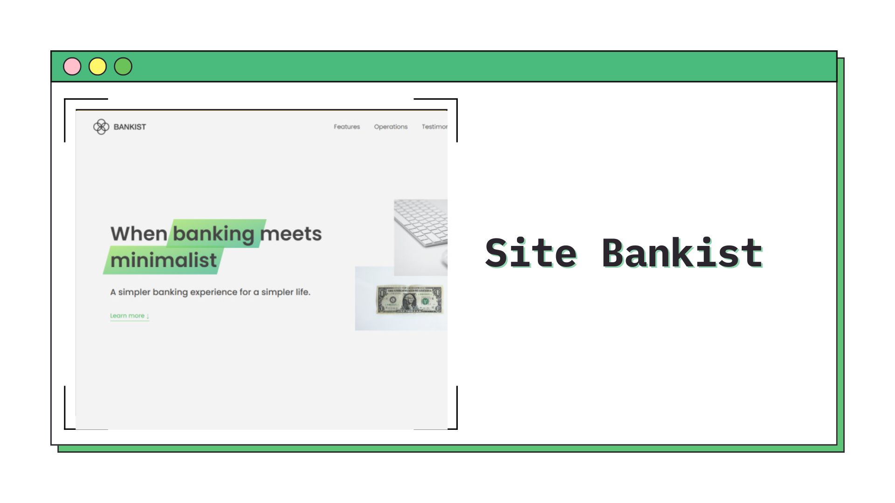

<h1 align="center">Bankist site
</h1>

<div align="left">

</div>

&nbsp;



<h2 align="center"> 
	🚧 Bankist site 🟢 Completed 🚀 🚧
  
</h2>

&nbsp;

<!--
## Table of contents

- [Project description](#description) - [What I learned](#What-I-learned) -->

<h2 id="#description">Project description 📚</h2>

This project was developed during Jonas Schmedtmann's JavaScript course, this is a fictional website for a bank where advanced DOM concepts were put into practice.

<!--
<a href="https://www.frontendmentor.io/challenges?difficulties=4"></a> -->

&nbsp;

## What I learned

- ### Modal window with class manipulation and events

```js
const openModal = function (e) {
  modal.classList.remove('hidden');
  overlay.classList.remove('hidden');
};

...

btnsOpenModal.forEach(btn => {
  btn.addEventListener('click', openModal);
});

...
```

- ### Implementing Smooth Scrolling with scrollIntoView

```js
btnScrollTo.addEventListener('click', function () {
  section1.scrollIntoView({
    behavior: 'smooth',
    block: 'start',
  });
});
```

- ### Implementing Page Navigation with Math strategy, bubble

```js
...

  if (e.target.classList.contains('nav__link')) {
    e.preventDefault();
    const sectionId = e.target.getAttribute('href');
    document.querySelector(sectionId).scrollIntoView({ behavior: 'smooth' });
  }

...
```

- ### Tabbed component with guard clause, classList.add, ClassList.remove, closest()

```js
  const clicked = e.target.closest('.operations__tab');

 // Guard clause
  if (!clicked) return;
...
```

- ### Menu fade animation with Closures, closest() and Math strategy, mouseover, mouseout

```js

// Math Strategy
...

 if (e.target.classList.contains('nav__link')) {
      const link = e.target;
      const sibling = document.querySelectorAll('.nav__link');
      const logo = link.closest('.nav').querySelector('img');
...

nav.addEventListener('mouseover', handleHover(0.5));
nav.addEventListener('mouseout', handleHover(1));
```

- ### Revealing Elements on Scroll with new IntersectionObserver

```js
...

const sectionObserver = new IntersectionObserver(revealSection, {
  root: null,
  threshold: 0.15,
});

...
```

- ### Lazy Loading Images with new IntersectionObserver

```js
...

const imgsObserve = new IntersectionObserver(loadImg, {
  root: null,
  threshold: 0,
  rootMargin: '200px',
});

...
```

- ### Building a Slider Component with Events and quite logica.

```js
...

const nextSlide = function () {
  if (curSlide === maxSlide - 1) {
    curSlide = 0;
  } else {
    curSlide++;
  }
  activeDots(curSlide);
  goToSlide(curSlide);
};

const prevSlide = function () {
  if (curSlide === 0) {
    curSlide = maxSlide - 1;
  } else {
    curSlide--;
  }
  activeDots(curSlide);
  goToSlide(curSlide);
};

...
```

## Links

- 🌎 [Preview Site](https://site-bankist-vinicius.netlify.app)

&nbsp;

## My process

### 🛠 Built with

<<<<<<< HEAD
- [HTML](https://developer.mozilla.org/en-US/docs/Web/HTML)
- [CSS](https://developer.mozilla.org/en-US/docs/Web/CSS)
- [Vanilla Js](http://vanilla-js.com)
=======
## 👨‍💻 Author
>>>>>>> 8e51f69077ed3fc4dd498f5aea8b7143372b1499

&nbsp;

## 👨‍💻 Author

- [Frontend Mentor](https://www.frontendmentor.io/profile/viniciusshenri96)
- [Linkedin](https://www.linkedin.com/in/vinícius-henrique-7a2533229/)
